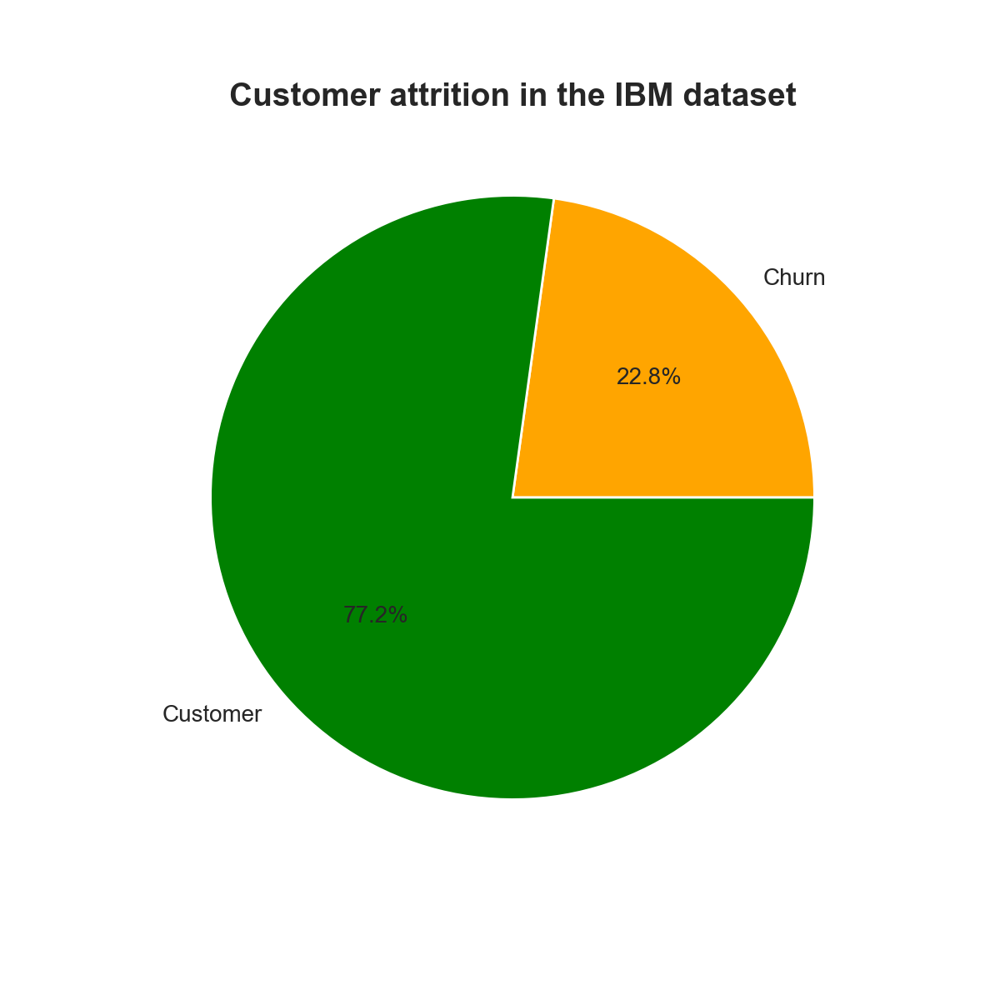

## A short notebook experimenting with the IBM Customer Churn Dataset

#### [See code here](IBM_Customer_churn.ipynb)

Data is made public by IBM and available on [Kaggle](https://www.kaggle.com/)

If you have trouble rendering the notebook, please copy and paste the link into [nbviewer](https://nbviewer.jupyter.org/)

